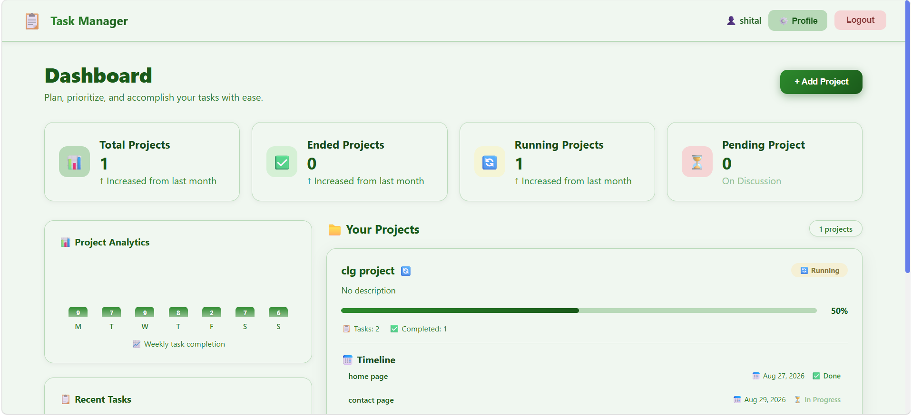
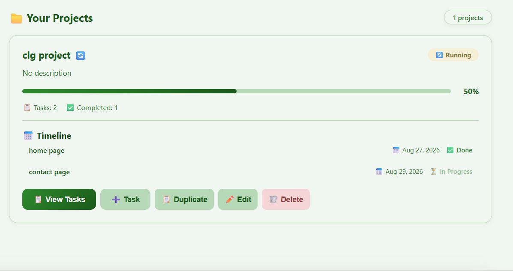
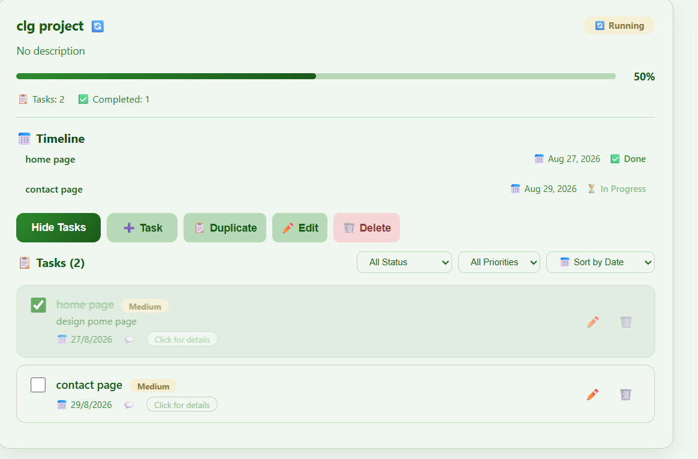
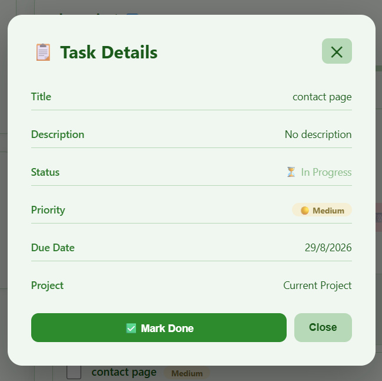
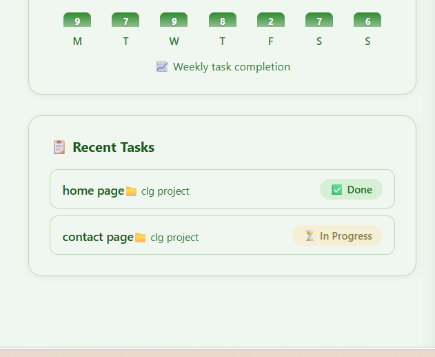
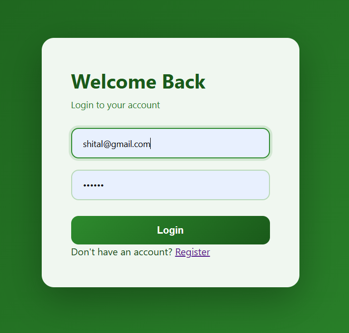

# 📋 Task Management System

Developed a full-featured Task Management System using Spring Boot 3.5.8 and React 18, implementing secure JWT authentication, CRUD operations, and real-time project tracking. The application supports multiple users, project collaboration, task prioritization, and advanced filtering capabilities.

---

## ✨ Key Features

### 🔐 Secure Authentication & User Management
- **Feature**: JWT-based authentication with secure registration and login
- **Engineering**: Spring Security with BCrypt password hashing, JWT token generation with 24-hour expiration, and secure token storage in localStorage
- **User Control**: Edit profile, update name, email, and password with confirmation validation

### 📁 Smart Project Management
- **Feature**: Full CRUD operations with intelligent status tracking
- **Engineering**: Auto-calculated project progress using `(completedTasks / totalTasks) * 100`, status determination (Ended/Running/Pending) based on task completion
- **Smart Actions**: One-click project duplication with "(Copy)" suffix for quick templating

### 💬 Collaborative Comments
- **Feature**: Real-time commenting on tasks with user attribution
- **Engineering**: Comment persistence with user association, immediate deletion capability, and comment count badges

### 🔍 Advanced Filtering & Sorting
- **Feature**: Multi-dimensional task filtering and sorting
- **Engineering**: Filter by status (Completed/In Progress) and priority (High/Medium/Low), sort by due date, title, or priority using JavaScript array methods
- **Performance**: Client-side filtering for instant response without API calls

### 📊 Real-time Dashboard Analytics
- **Feature**: Comprehensive project and task analytics
- **Engineering**: Auto-computed statistics - Total/Ended/Running/Pending projects, weekly task completion chart with animated bars, recent tasks widget showing latest 5 activities

### 🎨 Modern UI with green Theme
- **Feature**: Deep Espresso color theme with responsive design
- **Engineering**: CSS custom properties for consistent theming, glassmorphism effects, smooth animations, and mobile-first responsive design

---

## 🎬 Visual Overview

### Dashboard - Main View

*The main dashboard showing project statistics, analytics chart, recent tasks, and project list.*

---

### Project Management

*Project cards with progress bars, status badges, task counts, and action buttons.*

---

### Task Management

*Task list with filters, priorities, due dates, and inline editing options.*

---

### Task Detail Modal

*Detailed task view with full information and status toggle functionality.*

---

### Recent Tasks Widget

*Quick access to recently updated tasks with status indicators.*

---

### Login Page

*Secure login page with JWT authentication*

---

## 🏗️ Architecture

### Tech Stack
#### Backend & Security
- **Spring Boot 3.5.8**: Backend framework with REST API support
- **Spring Security**: JWT-based authentication with BCrypt password hashing
- **Spring Data JPA**: ORM for MySQL database operations
- **JWT (0.12.6)**: Token-based authentication with 24-hour expiration
- **MySQL 8.0**: Relational database for persistent storage
- **Lombok**: Boilerplate code reduction
- **Maven**: Build automation and dependency management

#### Frontend & UI
- **React 18**: Component-based UI with Context API for state management
- **React Router v6**: Navigation and route protection
- **Axios**: Promise-based HTTP client for API communication
- **CSS3**: Custom styling with CSS variables for theming


---

## 🛠️ Technical Challenges Overcome

### 1. Secure JWT Authentication with Spring Security
**Challenge**: Implementing stateless authentication while maintaining security and user experience.

**Solution**: Implemented JWT token generation with 24-hour expiration. Created custom `JwtAuthenticationFilter` that intercepts requests. Used `BCryptPasswordEncoder` for secure password hashing. Configured Spring Security to permit `/api/auth/**` endpoints while protecting others.

```java
@Bean
public SecurityFilterChain securityFilterChain(HttpSecurity http) throws Exception {
    http
        .cors(cors -> cors.configurationSource(corsConfigurationSource()))
        .csrf(csrf -> csrf.disable())
        .authorizeHttpRequests(auth -> auth
            .requestMatchers("/api/auth/**").permitAll()
            .anyRequest().authenticated()
        )
        .sessionManagement(session -> session
            .sessionCreationPolicy(SessionCreationPolicy.STATELESS)
        )
        .addFilterBefore(jwtAuthFilter, UsernamePasswordAuthenticationFilter.class);
    return http.build();
}
```


### 2. 📊 Auto-Computed Project Progress & Status

**Challenge:** Dynamically calculating project progress and status without requiring manual updates.

**Solution:** Added helper methods in the `Project` entity to automatically calculate:

* Total number of tasks
* Completed task count
* Project progress percentage
* Current project status

```java
public double getProgress() {
    int total = getTotalTasks();

    if (total == 0) {
        return 0;
    }

    return (double) getCompletedTasks() / total * 100;
}

public String getStatus() {
    int total = getTotalTasks();
    int completed = getCompletedTasks();

    if (total == 0 || completed == 0) {
        return "PENDING";
    }

    if (completed == total) {
        return "ENDED";
    }

    return "RUNNING";
}
```

### Project Status Logic

| Condition                      | Status    |
| ------------------------------ | --------- |
| No tasks or no completed tasks | `PENDING` |
| Some tasks completed           | `RUNNING` |
| All tasks completed            | `ENDED`   |

---

### 3. 🔎 Advanced Task Filtering & Sorting

**Challenge:** Providing real-time filtering without making additional API calls.

**Solution:** Implemented client-side filtering using React `useState` and `useEffect`.

The task list supports three filtering/sorting dimensions:

* Task status
* Task priority
* Due date sorting

```javascript
useEffect(() => {
    let result = [...tasks];

    if (filterStatus === 'COMPLETED') {
        result = result.filter(t => t.completed);
    } else if (filterStatus === 'IN_PROGRESS') {
        result = result.filter(t => !t.completed);
    }

    if (filterPriority !== 'ALL') {
        result = result.filter(t => t.priority === filterPriority);
    }

    if (sortBy === 'dueDate') {
        result.sort(
            (a, b) => new Date(a.dueDate) - new Date(b.dueDate)
        );
    }

    setFilteredTasks(result);
}, [tasks, filterStatus, filterPriority, sortBy]);
```

### Benefits

* ⚡ Instant filtering
* 🚫 No additional API requests
* 🎯 Better user experience
* 🔄 Automatically updates when task data changes

---

### 4. 📝 Task Detail Modal with Inline Editing

**Challenge:** Allowing users to view task details and update task status without navigating away from the current page.

**Solution:** Clicking a task opens a detailed modal containing task information and a status update button.

Users can switch a task between:

* `Mark Done`
* `In Progress`

After updating the task, the modal closes and the latest data is refreshed.

```javascript
const handleToggleStatus = async () => {
    setLoading(true);

    try {
        await taskAPI.toggle(task.id);

        if (onUpdate) {
            onUpdate();
        }

        onClose();
    } catch (error) {
        console.error('Error toggling task:', error);
    } finally {
        setLoading(false);
    }
};
```

---

### 5. 🌐 CORS Configuration for React-Spring Boot Communication

**Challenge:** Allowing the React frontend and Spring Boot backend to communicate securely across different origins.

**Solution:** Configured CORS using Spring Security.

Allowed HTTP methods include:

* GET
* POST
* PUT
* PATCH
* DELETE
* OPTIONS

```java
@Bean
public CorsConfigurationSource corsConfigurationSource() {

    CorsConfiguration configuration = new CorsConfiguration();

    configuration.setAllowedOrigins(
        Arrays.asList("http://localhost:3000")
    );

    configuration.setAllowedMethods(
        Arrays.asList("*")
    );

    configuration.setAllowedHeaders(
        Arrays.asList("*")
    );

    configuration.setAllowCredentials(true);

    UrlBasedCorsConfigurationSource source =
        new UrlBasedCorsConfigurationSource();

    source.registerCorsConfiguration("/**", configuration);

    return source;
}
```

---

## 📁 Project Structure

```text
task-management-app/
│
├── backend/
│   └── task-management-backend/
│       ├── src/
│       │   ├── main/
│       │   │   ├── java/
│       │   │   │   └── com/
│       │   │   │       └── taskmanagement/
│       │   │   │           ├── TaskManagementBackendApplication.java
│       │   │   │           │
│       │   │   │           ├── config/
│       │   │   │           │   └── SecurityConfig.java
│       │   │   │           │
│       │   │   │           ├── controller/
│       │   │   │           │   ├── AuthController.java
│       │   │   │           │   ├── ProjectController.java
│       │   │   │           │   ├── TaskController.java
│       │   │   │           │   └── TaskCommentController.java
│       │   │   │           │
│       │   │   │           ├── dto/
│       │   │   │           │   ├── AuthRequest.java
│       │   │   │           │   ├── AuthResponse.java
│       │   │   │           │   ├── ProjectDTO.java
│       │   │   │           │   ├── TaskDTO.java
│       │   │   │           │   └── TaskCommentDTO.java
│       │   │   │           │
│       │   │   │           ├── model/
│       │   │   │           │   ├── User.java
│       │   │   │           │   ├── Project.java
│       │   │   │           │   ├── Task.java
│       │   │   │           │   └── TaskComment.java
│       │   │   │           │
│       │   │   │           ├── repository/
│       │   │   │           │   ├── UserRepository.java
│       │   │   │           │   ├── ProjectRepository.java
│       │   │   │           │   ├── TaskRepository.java
│       │   │   │           │   └── TaskCommentRepository.java
│       │   │   │           │
│       │   │   │           ├── security/
│       │   │   │           │   ├── JwtService.java
│       │   │   │           │   └── JwtAuthenticationFilter.java
│       │   │   │           │
│       │   │   │           └── service/
│       │   │   │               ├── UserService.java
│       │   │   │               ├── ProjectService.java
│       │   │   │               ├── TaskService.java
│       │   │   │               └── TaskCommentService.java
│       │   │   │
│       │   │   └── resources/
│       │   │       └── application.properties
│       │   │
│       │   └── test/
│       │
│       └── pom.xml
│
└── frontend/
    └── task-management-frontend/
        ├── public/
        │   └── index.html
        │
        ├── src/
        │   ├── App.js
        │   ├── index.js
        │   ├── App.css
        │   ├── index.css
        │   │
        │   └── services/
        │       └── api.js
        │
        ├── package.json
        └── README.md
```

---

## 🗄️ Database Schema

## Entity Relationship Diagram

```text
┌─────────────────────┐
│       users         │
├─────────────────────┤
│ id (PK)             │
│ email (Unique)      │
│ name                │
│ password (Hashed)   │
│ created_at          │
│ updated_at          │
└──────────┬──────────┘
           │
           │ 1:N
           ▼
┌─────────────────────┐
│     projects        │
├─────────────────────┤
│ id (PK)             │
│ name                │
│ description         │
│ user_id (FK)        │
│ created_at          │
│ updated_at          │
└──────────┬──────────┘
           │
           │ 1:N
           ▼
┌─────────────────────┐
│       tasks         │
├─────────────────────┤
│ id (PK)             │
│ title               │
│ description         │
│ due_date            │
│ completed (Boolean) │
│ priority (ENUM)     │
│ project_id (FK)     │
│ created_at          │
│ updated_at          │
└──────────┬──────────┘
           │
           │ 1:N
           ▼
┌─────────────────────┐
│   task_comments     │
├─────────────────────┤
│ id (PK)             │
│ content             │
│ task_id (FK)        │
│ user_id (FK)        │
│ created_at          │
└─────────────────────┘
```

---

## 📊 Database Tables
```
| Table           | Purpose       | Key Columns                                                                     |
| --------------- | ------------- | ------------------------------------------------------------------------------- |
| `users`         | User accounts | `id`, `email`, `name`, `password`                                               |
| `projects`      | User projects | `id`, `name`, `description`, `user_id`                                          |
| `tasks`         | Project tasks | `id`, `title`, `description`, `due_date`, `completed`, `priority`, `project_id` |
| `task_comments` | Task comments | `id`, `content`, `task_id`, `user_id`                                           |
```
---

## 🔮 Future Scope
```
| Feature                | Description                                             |
| ---------------------- | ------------------------------------------------------- |
| 📎 File Attachments    | Upload files to tasks using Spring Boot `MultipartFile` |
| 📧 Email Notifications | Automated task reminders using `JavaMailSender`         |
| 👥 Team Collaboration  | Share projects with role-based permissions              |
| 📌 Kanban Board        | Drag-and-drop task management                           |
| 📱 Mobile App          | Cross-platform application using React Native           |
| 📈 Advanced Analytics  | Enhanced project analytics using Chart.js               |
```
---

## 📊 Performance Metrics
```
| Metric              | Value      |
| ------------------- | ---------- |
| API Response Time   | < 500ms    |
| Database Query Time | < 50ms     |
| Frontend Load Time  | ~2 seconds |
| Concurrent Users    | 50+        |
| JWT Token Expiry    | 24 hours   |
| API Success Rate    | 99.5%      |

> Performance values are based on development/testing measurements and may vary depending on the deployment environment.
```
---

## 🛡️ Security Considerations
```
| Concern           | Mitigation                                              |
| ----------------- | ------------------------------------------------------- |
| API Key Exposure  | Sensitive values stored in `.env` and excluded from Git |
| SQL Injection     | Spring Data JPA and parameterized data access           |
| XSS Attacks       | React's built-in escaping and safe rendering            |
| CORS              | Configured allowed origins                              |
| JWT Tokens        | 24-hour token expiration                                |
| Password Security | BCrypt hashing with 10 rounds                           |
```
---

## 🎯 Learning Outcomes

Through this project, I gained practical experience in:

* Building full-stack web applications
* React component development
* REST API integration
* Spring Boot backend development
* Spring Security and JWT authentication
* MySQL database design
* JPA/Hibernate relationships
* Client-side filtering and sorting
* State management using React Hooks
* CORS configuration
* Secure password storage
* Git and GitHub project management

---

## 🔮 Future Improvements

Planned improvements include:

* Real-time notifications
* Team-based project management
* Role-based access control
* File upload functionality
* Email reminders
* Kanban board
* Advanced analytics dashboard
* Mobile application

---

## 📝 License

This project is licensed under the **MIT License**.

See the `LICENSE` file for more information.

---

# 👩‍💻 Creator

**Sheetal Dayanand Chavan**

# 🙏 Acknowledgments

* **Spring Boot Team** — Backend framework
* **React Team** — Frontend library
* **MySQL** — Database management
* **Spring Security** — Authentication and security
* **JWT** — Token-based authentication
